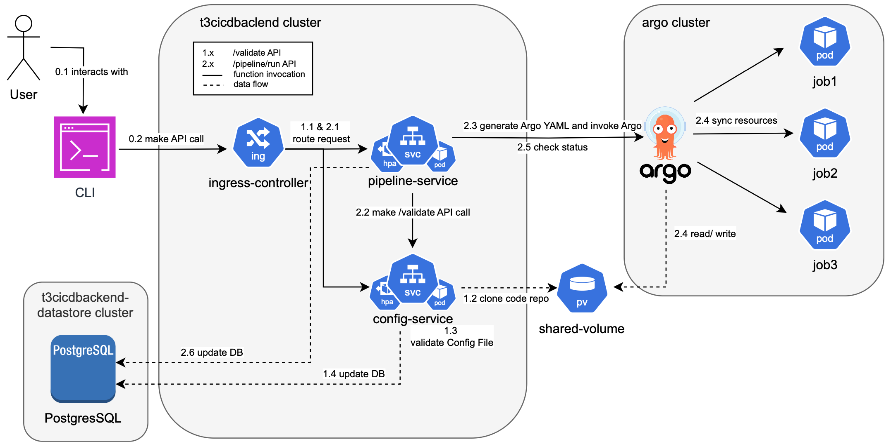

# t3-cicd-backend

A Java library for executing/ orchestrating the CI/CD.
This Library uses the Spring Boot framework and JDK 21, built by Gradle, and deployed by Kubernetes.

Developer Documentation: https://docs.google.com/document/d/1wbyMICGzKt7-Wu9GzD_DK_xpOU29ml3RfjknHgq26FA/edit?usp=sharing



## Table of Contents

- [Repository Layout](#repository-layout)
- [Development Setup](#development-setup)
  - [Prerequisites](#prerequisites)
  - [Build Instructions](#build-instructions)
  - [Running Tests](#running-tests)
  - [K8s Local Deployment](#k8s-local-deployment)
  - [API Testing](#api-testing)
  - [Other Useful Commands](#other-useful-commands)
- [User Manual](#user-manual)
  - [Deploy service](#deploy-service)
- [Pull Request Process](#pull-request-process)
  - [Creating a PR](#creating-a-pr)
  - [Rules for PRs](#rules-for-prs)
- [CI/CD Workflows](#cicd-workflows)
- [License](#license)

## Repository Layout
The repo `t3-cicd-backend` has several microservices and is organized as below:
```
t3-cicd-backend/
├── configservice/               # subproject for configservice, referencing shared subproject
│   ├── src/
│   ├── build.gradle.kts         # declaring shared in dependencies so it can be referenced
│   ├── Dockerfile               # build Docker image for configservice for K8s deployment
│   └── ...
├── pipelineservice/             # subproject for pipelineservice, referencing shared subproject
│   ├── src/
│   ├── build.gradle.kts         # declaring shared in dependencies so it can be referenced
│   ├── Dockerfile               # build Docker image for pipelineservice for K8s deployment
│   └── ...
├── shared/                      # subproject for shared resources (DB entity, repositories, constants...), not a real "service"
│   ├── src/
│   ├── build.gradle.kts
│   └── ...
├── minikube/                    # K8s deployment
│   ├── scripts/                 # Scripts to automate deployemnt
│       ├── deploy_Linux_dev.sh  # Script for developer using Linux
│       └── ...
│   ├── postgres-secret.yaml
│   ├── ...
│   ├── K8sDeployment_user.md    # K8s manual deployment guide for user
│   └── K8sDeployment_dev.md     # K8s manual deployment guide for developer
├── settings.gradle.kts          # declare subprojects here
```

## Development Setup

### Prerequisites
To use this library, you need:
- Java 21 or higher
- Gradle (for building)
- Minikube and Docker
  - Make sure Docker is running on your system.

### Build Instructions

Clone the repository:
```bash
git clone https://github.com/CS6510-SEA-F24/t3-cicd-backend.git
```

Each of the subprojects can be built separately. To build the subproject locally, run:
```bash
./gradlew :<subproject>:doAll # doAll is a custom build script, check `build.gradle.kts` for more details
# e.g. ./gradlew :configservice:doAll
```

### Running Tests
To run all unit tests, execute the following command:
```bash
./gradlew :<subproject>:test
```

To run all tests with coverage reports (Jacoco):
```bash
./gradlew :<subproject>:jacocoTestReport
```
You can find the coverage report under `build/reports/jacoco/test/html`. 
**If test coverage is below 80%, the build will fail.**

### Other Useful Commands
**Check Code Style**: Run Checkstyle to ensure the code follows style guidelines:
```bash
./gradlew :<subproject>:checkstyleMain # CheckStyle will run against src/main
./gradlew :<subproject>:checkstyleTest # CheckStyle will run against src/test
```
You can find the CheckStyle report under `build/reports/checkstyle`.

**SpotBugs**: Static analysis for bug detection:
```bash
./gradlew :<subproject>:spotbugsMain # SpotBugs will run against src/main
./gradlew :<subproject>:spotbugsTest  # # SpotBugs will run against src/main
```
You can find the SpotBugs report under `build/reports/spotbugs`.

>CheckStyle and SpotBugs warnings will NOT fail the build. However, it's recommended to run these 
checks and use your best judgement to incorporate any fixes/recommendations.

**Generate Javadoc**: To generate project documentation:
```bash
./gradlew :<subproject>:javadoc
```

### K8s Local Deployment

> The deployment guide below will help you set up a fully functional local K8s cluster with all necessary components.
> However, depending on your specific system configuration and network settings, extra configurations might be required.

#### Automated Deployment
We provide beta-version scripts in `minikube/scripts` to automate the deployment process.
Use the script corresponding to your operating system:
- Linux or macOS:
  ```bash
  cd minikube/scripts
  chmod +x deploy_Linux_Mac_dev.sh
  ./deploy_Linux_Mac_dev.sh
  ```
- Windows: Open PowerShell as Administrator and run
  ```bash
  Set-ExecutionPolicy -Scope Process -ExecutionPolicy Bypass
  cd minikube/scripts
  .\deploy_Windows_dev.ps1
  ```
  > Note: PowerShell's execution policy may the script from running. 
  > By default, PowerShell may have a restrictive execution policy set (e.g., Restricted),
  > which blocks script execution for security reasons.
  > Running `Set-ExecutionPolicy -Scope Process -ExecutionPolicy Bypass` bypasses any restriction.


These scripts are designed to handle most deployment steps.
However, as they are beta versions, they may not cover all edge cases across different systems.
If you encounter issues, see the Manual Deployment section below.

#### Manual Deployment
If you prefer manual deployment or encounter issues with the scripts,
refer to the step-by-step guide in [K8sDeployment_dev.md](minikube/K8sDeployment_dev.md) for the step-by-step deployment guide.

Note the order of deployment should be followed (DB -> Backend services -> Ingress Controller).

#### Common Issues:

- **Docker Not Running:** Ensure Docker is running on your system.
  On Linux, you may need to start it with `sudo systemctl start docker`. On macOS, use `open -a Docker`.
- **Minikube Configuration:** Ensure Minikube is set up with sufficient resources (CPU, memory).
  Use something like:
  ```bash
  minikube start --cpus=4 --memory=8192

### API Testing

Once the deployment is complete, verify the setup by testing the API endpoints:
1. Start the minikube tunnel:
```bash
minikube tunnel
```

2. Check service status
```bash
curl -i http://localhost/actuator/health
```

3. Example `curl` commands to test the `/validate` API
```bash
curl -X POST http://localhost/validate \
  -H "Content-Type: application/json" \
  -d '{
        "repo_url": "https://github.com/yuhangot/RemoteTest.git",
        "branch": "main",
        "pipeline_name": "pipeline"
      }';

curl -X POST http://localhost/validate \
  -H "Content-Type: application/json" \
  -d '{
        "repo_url": "https://github.com/yuhangot/RemoteTest.git",
        "branch": "main",
	    "config_path": ".cicd-pipelines/yamlContent.yaml"
      }';
```

4. Example `curl` commands to test the `/pipeline/run` API
```bash
curl -X POST http://localhost/pipeline/run \
  -H "Content-Type: application/json" \
  -d '{
        "repo_url": "https://github.com/yuhangot/RemoteTest.git",
        "branch": "main",
        "pipeline_name": "pipeline"
      }';

curl -X POST http://localhost/pipeline/run \
  -H "Content-Type: application/json" \
  -d '{
        "repo_url": "https://github.com/yuhangot/RemoteTest.git",
        "branch": "main",
	    "config_path": ".cicd-pipelines/yamlContent.yaml"
      }';
```

5. To examine DB, please follow **7. View Data in GUI (PGAdmin)** in [K8sDeployment_dev.md](minikube/K8sDeployment_dev.md).
## User Manual

### Prerequisites

To use the service, you need:
- Minikube and Docker
  - Make sure Docker is running on your system.

### Deploy Service

Clone the repository (we will only use the `minikube` directory):
```bash
git clone https://github.com/CS6510-SEA-F24/t3-cicd-backend.git
```

> The deployment guide below will help you set up a fully functional local K8s cluster with all necessary components.
> However, depending on your specific system configuration and network settings, extra configurations might be required.

#### Automated Deployment
We provide beta-version scripts to automate the deployment process.
Use the script corresponding to your operating system:
- Linux or macOS:
  ```bash
  cd minikube/scripts
  chmod +x deploy_Linux_Mac_dev.sh
  ./deploy_Linux_Mac_dev.sh
  ```
- Windows: Open PowerShell as Administrator and run
  ```bash
  Set-ExecutionPolicy -Scope Process -ExecutionPolicy Bypass
  cd minikube/scripts
  .\deploy_Windows_dev.ps1
  ```
  > Note: PowerShell's execution policy may the script from running. By default, PowerShell may have a restrictive execution policy set (e.g., Restricted), which blocks script execution for security reasons. Running `Set-ExecutionPolicy -Scope Process -ExecutionPolicy Bypass` bypasses any restriction


These scripts are designed to handle most deployment steps.
However, as they are beta versions, they may not cover all edge cases across different systems.
If you encounter issues, see the Manual Deployment section below.

#### Deployment Scripts
If you prefer manual deployment or encounter issues with the scripts,
refer to the step-by-step guide in the [K8sDeployment_user.md](minikube/K8sDeployment_user.md) for the step-by-step deployment guide.

Note the order of deployment should be followed
(DB -> Backend services -> Ingress Controller).

#### Common Issues:

- **Docker Not Running:** Ensure Docker is running on your system.
  On Linux, you may need to start it with `sudo systemctl start docker`.
- **Minikube Configuration:** Ensure Minikube is set up with sufficient resources (CPU, memory).
  Use something like:
  ```bash
  minikube start --cpus=4 --memory=8192
  ```

## Pull Request Process

### Creating a PR
#### **Always use feature branch to make change**:
  ```bash
  git checkout -b <branch_name> # create a new branch with <branch_name>
  ```
>  Direct push to the main branch is strictly forbidden as this is the Production branch. All change
>  should be merged with approved PR.

#### **Ensure your code is up-to-date with the `main` branch**:
  ```bash
  git config pull.rebase true # always use rebase to reconcile divergent branches
  git pull
  ```

> Regularly pull from the main branch avoids conflicts pilling up.
  Please make sure you pull again before creating a PR.

#### **Follow the PR Template**:
- Your PR description should address any relevant context to help the reviewer to understand the 
PR. If this is related to an issue, reference the issue in the description.
- Make sure to use the checklist, and give explanations to any unchecked ones.
#### **Check PR details**:
- Make sure the origin and destination of the PR is correct, as well as everything in the Commits 
and Files changed tabs before clicking "Create Pull Request".
#### **Submit your PR**:
- No need to manually select reviewers. Once the PR is created, 2 reviewers will be automatically 
assigned based on the [Reviewer Lottery](https://github.com/marketplace/actions/reviewer-lottery)
process.

### Rules for PRs

#### **PR Size Limit**:  
- PRs should not exceed 150 lines unless absolutely necessary. 
  > To override this, add "override-size-limit" in the PR title or description, and provide explanation.

#### Testing: 
- Ensure all new code is properly tested.

#### Commit Guidelines: 
- Use [meaningful commit messages](https://www.freecodecamp.org/news/how-to-write-better-git-commit-messages/). 
Squash commits if necessary to clean up the history.

#### Merging:
- When merging PRs, always use **SQUASH AND MERGE** to combine all changes into a single commit.

#### Review Timebox:
- Please post reviews within 48 hours after you received the review request, or ask for others to
do the review.

## CI/CD Workflows
This project uses **GitHub Actions** for CI/CD automation. The configured CI/CD workflows are:

- **PR Size Check**:
  - This workflow is triggered when a new PR is created, or when a new commit is pushed to an existing PR.
  - It fails if the size of PR is greater than 150 lines, and no override label is provided.

- **Assign Reviewers**:
  - This workflow is triggered when a new PR is created, and PR Size Check completes successfully.
  - It assigns 2 random reviewers to the PR.

- **Pipeline Run**:
  - This workflow is triggered when:
    - "PR Size Check" workflow completes successfully.
    - A PR is merged.
  - This workflow will execute:
    - Build: Ensures the code builds successfully. 
    - Run Unit Tests: All tests must pass. 
    - Test Coverage Verification: Verifies that test coverage meets minimum requirements.
    - Code Quality Checks: Checkstyle and SpotBugs 
    - Artifacts Upload: Build artifacts and generated reports are uploaded after pipeline run

## License
This project is licensed under the MIT License. See the `LICENSE` file for more details.